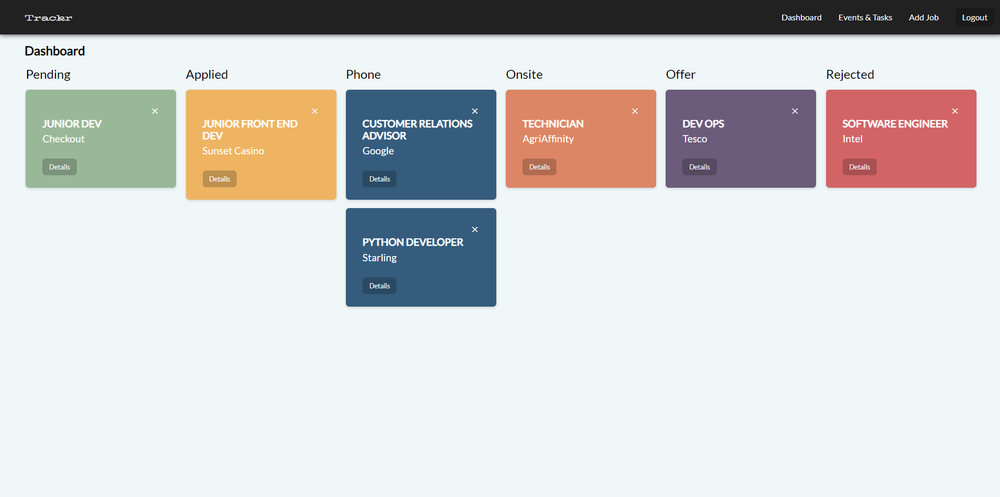

# Trackr

<p align="center">
  
</p>

Trackr is an easy to use web app built to help you track applications during the job seeking process.

## Features

- Create multiple User Accounts
- Each stage of the application tracked and shown in its own section
- Each job card directs to a details page for that job
- Create a list of todos for each job
- Create events for each job and save to any of the following external calendars:

  - Google
  - Apple
  - Outlook
  - Yahoo

## Screenshots

<p align="center">
  
</p>

## Getting Started

Except for the regular suspects; git, Node, npm, you need these things to work on the Trackr app. Follow the instructions supplied below them or on their links to get them up and running before you continue with _Installation_.

- [Firebase](https://firebase.google.com)

## Installation

1. Clone this repo and enter!

```bash
  git clone https://github.com/Keval-P21/trackr.git
  cd trackr
```

2. Install dependencies in both the client and server folders.

```bash
  cd client                 # ! Change into the client folder !
  npm install
```

```bash
  cd ../server              # ! Change into the server folder !
  npm install
```

3. Setup the .env files (.env.example file are given in both the client and server folder)

- create a Firebase project (JavaScript), save your Firebase details in the **client/.env** file
- add a Firebase service account (NodeJs) and save this file in the **server/firebase-config** folder as **serviceAccount.json**
- start MongoDB and add the required Port and Database name to **server/.env** file to connect to your database

4. Run the server

```bash
  cd server                 # ! New terminal and change into the server folder !
  npm start
```

5. Run the client

```bash
  cd client                 # ! New terminal and change into the client folder !
  npm start
```

## Technology Used

- [React](https://reactjs.org/)
- [NodeJs](https://nodejs.org/en/)
- [Express.js](https://expressjs.com/)
- [MongoDB](https://www.mongodb.com/)
- [Firebase](https://firebase.google.com/)
- [Mongoose](https://mongoosejs.com/)

## Author

Keval Patel - [Github](https://github.com/Keval-P21) - [LinkedIn](www.linkedin.com/in/keval-r-patel)
